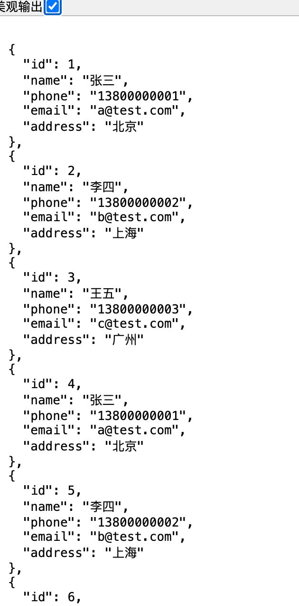
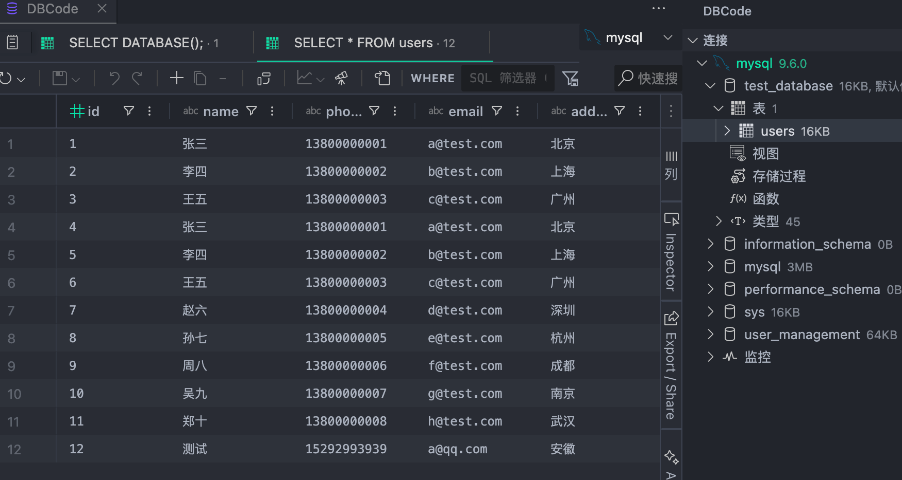

#  初始化项目
```bash
mkdir backend
cd backend

pnpm init -y
```

# 安装依赖
```bash
npm install express mysql2
```

开发调试工具（可选）：
```bash
pnpm install nodemon -D
```

# 创建目录结构
```bash
backend/
├── app.js
├── db.js
├── routes/
│   └── user.js
└── package.json
```
# 四、数据库连接（db.js）
```js
import mysql from 'mysql2'

export const db = mysql.createConnection({
  host: 'localhost',
  user: 'root',
  password: '123456',
  database: 'test_database'
})
```


# 五、入口文件（app.js）
```js
import express from 'express'
import userRoutes from './routes/user.js'

const app = express()

app.use(express.json())

app.use('/api', userRoutes)

app.listen(3000, () => {
  console.log('Server running on http://localhost:3000')
})
```
# 六、用户路由（routes/user.js）
```js
import express from 'express'
import { db } from '../db.js'

const router = express.Router()

// 查询用户
router.get('/users', (req, res) => {
  db.query('SELECT * FROM users', (err, result) => {
    if (err) return res.status(500).json(err)
    res.json(result)
  })
})

export default router
```
# 七、配置 package.json（支持 ESModule + 启动）
```js
{
  "type": "module",
  "scripts": {
    "start": "node app.js",
    "dev": "nodemon app.js"
  }
}
```

# 八、SQL命令新增数据
```sql
-- 创建数据库（如果不存在）
CREATE DATABASE IF NOT EXISTS test_database;

-- 使用数据库
USE test_database;

-- 创建表
CREATE TABLE IF NOT EXISTS users (
  id INT AUTO_INCREMENT PRIMARY KEY,
  name VARCHAR(50) NOT NULL,
  phone VARCHAR(20) NOT NULL,
  age INT DEFAULT NULL,
  email VARCHAR(100),
  address VARCHAR(255),
  created_at TIMESTAMP DEFAULT CURRENT_TIMESTAMP,
  updated_at TIMESTAMP DEFAULT CURRENT_TIMESTAMP ON UPDATE CURRENT_TIMESTAMP
);

-- 添加唯一索引（避免手机号重复）
ALTER TABLE users
ADD UNIQUE KEY uniq_phone (phone);

-- 插入数据（幂等写法，避免重复）
INSERT INTO users (name, phone, email, address)
VALUES 
('张三', '13800000001', 'a@test.com', '北京'),
('李四', '13800000002', 'b@test.com', '上海'),
('王五', '13800000003', 'c@test.com', '广州'),
('赵六', '13800000004', 'd@test.com', '深圳'),
('孙七', '13800000005', 'e@test.com', '杭州'),
('周八', '13800000006', 'f@test.com', '成都'),
('吴九', '13800000007', 'g@test.com', '南京'),
('郑十', '13800000008', 'h@test.com', '武汉')
ON DUPLICATE KEY UPDATE
email = VALUES(email),
address = VALUES(address);

-- 查询数据
SELECT * FROM users;

-- 查看当前数据库
SELECT DATABASE();
```

# 八、启动项目
```bash
pnpm dev
```
浏览器直接访问
```bash
http://localhost:3000/api/users
```
效果：

我用的vscode插件：`DBCode`


我用的管理数据库工具：
DBeaver

